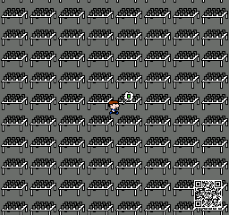

# NES Code Crash Course
* Presented at Fire & Ice RGX 2025

## Building
* Simply run `make`
    * Requires make, ca65, and ld65 to be included in your PATH.
* Alternatively, run `rebuild.bat` on Windows or `rebuild.sh` on MacOS and Linux.
    * Requires ca65 and ld65 to be included in your PATH.
## File Summary
* `gamehunt2025.s`
    * Complete source code in 6502 assembly.
* `data.inc`
    * Complete read-only data including colors, initial sprite state, links to nametables, and link to the pattern table.
* `system.inc`
    Canonical names for NES registers and sprite OAM data layout.
* `nrom.cfg`
    * Linker configuration for a basic [NES NROM](https://www.nesdev.org/wiki/NROM) rom file.
* `gamehunt2025.nes`
    * Prebuilt rom file.